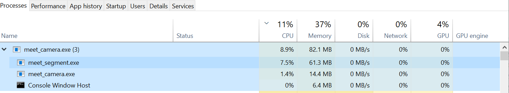

# Openvino and google_meet_model, Why not ?!? 
Google meet model run with openvino inference to optimize performance in intel x64 machine

## This project simulates Zoom Meeting virtual background flow:
- Process meet_camera get input from camera to do meeting stub standalone.(x86,x64...)
- Process meet_segment support virtual background for meet_camera.(only x64 support by openvino)
- These 2 process using share memory to communicate.

**So this project solves the problem of architectural differences from x86 application and openvino toolkit support x64 app.**

## Demo
**Awesome segment**

https://user-images.githubusercontent.com/22221442/132448362-2cf5f0a8-4e2a-4716-9df1-f777b775df0e.mp4 

**Low CPU on Lenovo Thinkpad i5-8250U**

https://user-images.githubusercontent.com/22221442/132448375-7a7eb5ac-bfa0-4d86-95fb-a66a6b722e6c.mp4

**Just cpu processing, not using gpu**


## Step to build
- Install openvino tool kit and setup environment https://software.intel.com/content/www/us/en/develop/tools/openvino-toolkit.html
- Open meet_segment.sln visual studio Release x64
- Check general link include in project point to right place (openvino, opencv)
- Build meet_camera.exe & meet_segment.exe file
- Run deploy script to copy dll and resource file to exe folder

## How to run
- Run meet_camera.exe in bin folder, meet_segment.exe auto start following

## Reference articles
- https://github.com/PINTO0309/PINTO_model_zoo/tree/main/082_MediaPipe_Meet_Segmentation
- https://github.com/Volcomix/virtual-background
- https://software.intel.com/content/www/us/en/develop/tools/openvino-toolkit.html

## Note:
Script to build IR from ONNX:
```
python mo.py --input_model meet3.onnx --input_shape [1,144,256,3] --scale 255 --data_type FP32
```
